# 🐳 JeevanLink Blood Donor Application — Docker Deployment Guide

Welcome to the JeevanLink Docker deployment guide. This document provides step-by-step instructions and command cheatsheets to package, build, and run the entire blood donor ecosystem—including the React + Vite frontend and the 9 Spring Boot microservices—using Docker and Docker Compose.

---

## 🏗️ System Architecture Overview

The application is fully containerized, running inside an isolated Docker bridge network (`blood-donor-network`). The React frontend is served via high-performance **Nginx** (which also handles SPA routing and API reverse-proxying), while the Spring Boot backend services register themselves with a central **Eureka Service Registry** and pull properties from a **Spring Cloud Config Server**.

```mermaid
graph TD
    %% Styling
    classDef infra fill:#2d3748,stroke:#4a5568,stroke-width:2px,color:#fff;
    classDef app fill:#1a365d,stroke:#2b6cb0,stroke-width:2px,color:#fff;
    classDef client fill:#22543d,stroke:#2f855a,stroke-width:2px,color:#fff;
    
    %% Client/Frontend
    Browser[🌐 Web Browser Client] -->|Port 80| Nginx[🐳 Frontend Container Nginx]
    
    %% Subsystem Grouping
    subgraph Frontend Subsystem
        Nginx
    end
    
    %% Gateway and Registry
    Nginx -->|Reverse Proxy /api| Gateway[🐳 api-gateway :8080]
    
    subgraph Infrastructure Service Mesh
        Registry[🐳 service-registry Eureka :8761]
        Config[🐳 config-server :8888]
        Gateway
    end
    
    %% Core Services
    subgraph Core Microservices
        UserService[🐳 user-service :8081]
        DonorService[🐳 donor-service :8082]
        HospitalService[🐳 hospital-service :8083]
        RequestService[🐳 request-service :8084]
        AIMatcher[🐳 ai-matcher-service :8085]
        Notification[🐳 notification-service :8086]
    end

    %% Registrations and config
    Gateway -->|Register & Resolve| Registry
    UserService -->|Register & Resolve| Registry
    DonorService -->|Register & Resolve| Registry
    HospitalService -->|Register & Resolve| Registry
    RequestService -->|Register & Resolve| Registry
    AIMatcher -->|Register & Resolve| Registry
    Notification -->|Register & Resolve| Registry
    
    Gateway -.->|Fetch Config| Config
    UserService -.->|Fetch Config| Config
    DonorService -.->|Fetch Config| Config
    HospitalService -.->|Fetch Config| Config
    RequestService -.->|Fetch Config| Config
    AIMatcher -.->|Fetch Config| Config
    Notification -.->|Fetch Config| Config
    
    %% API Routing
    Gateway -->|Route /api/v1/users| UserService
    Gateway -->|Route /api/v1/donors| DonorService
    Gateway -->|Route /api/v1/hospitals| HospitalService
    Gateway -->|Route /api/v1/requests| RequestService
    Gateway -->|Route /api/v1/matcher| AIMatcher
    Gateway -->|Route /api/v1/notifications| Notification

    class Registry,Config,Gateway infra;
    class UserService,DonorService,HospitalService,RequestService,AIMatcher,Notification app;
    class Nginx client;
```



---

## ⚡ Quick Start: Orchestrated Run (Highly Recommended)

Running 10 separate containers individually is complex. We have configured a root-level `docker-compose.yml` that handles build order, networking, port exposing, environment configurations, and automatic crash-recovery seamlessly.

### Prerequisites
Make sure you package the backend Spring Boot microservices into `.jar` files on your host machine first (since the Dockerfiles utilize a super lightweight JRE base image for maximum performance and minimum size):
```bash
# From the root workspace directory:
cd backend
mvn clean package -DskipTests
cd ..
```

### The One-Command Startup
To build and start **all services** (including the React frontend and 9 backend services):
```bash
docker compose up --build -d
```
*The `-d` flag runs the containers in the background (detached mode).*

### Monitoring and Stop Commands
```bash
# View real-time aggregated logs of all services
docker compose logs -f

# View logs of a specific service (e.g., user-service)
docker compose logs -f user-service

# Check the running status of all containers
docker compose ps

# Gracefully stop and remove all container resources and networks
docker compose down
```

---

## 🎨 1. Frontend Docker Commands (React + Vite)

The frontend uses a multi-stage Dockerfile:
1. **Stage 1 (Node 18):** Installs dependencies and runs `npm run build` to create static files inside `/app/dist`.
2. **Stage 2 (Nginx):** Spins up a super-lightweight Nginx container, copies the static files, and applies a custom `nginx.conf` designed for single-page applications.

### Build the Frontend Image
Navigate to the `frontend` directory and run:
```bash
# Go to frontend folder
cd frontend

# Build the production-ready Nginx-hosted Docker image
docker build -t jeevanlink-frontend:latest .
```

### Run the Frontend Standalone
```bash
# Run the frontend on port 80 (accessible at http://localhost)
docker run -d -p 80:80 --name jeevanlink-frontend-app jeevanlink-frontend:latest
```

### Useful Standalone Commands
```bash
# Stop the running container
docker stop jeevanlink-frontend-app

# Start it back up
docker start jeevanlink-frontend-app

# View logs of the web server
docker logs -f jeevanlink-frontend-app

# Remove the container instance
docker rm -f jeevanlink-frontend-app
```

---

## ☕ 2. Backend Microservice Docker Commands

Each backend Spring Boot application contains a lightweight JRE 17 Alpine Dockerfile designed to copy the compiled `.jar` inside the local `target` folder.

### Step 1: Package the Applications (Maven)
Before building any Docker images, package the parent Maven project. This generates all target `.jar` files:
```bash
cd backend
mvn clean package -DskipTests
```

### Step 2: Build and Run Individual Services
You can package and start individual microservices manually if you do not wish to use Docker Compose. Below are the commands for each:

#### 1. Service Registry (Eureka Server)
```bash
# Build
docker build -t jeevanlink-service-registry:latest ./backend/infrastructure/service-registry

# Run (Port 8761)
docker run -d -p 8761:8761 --name service-registry jeevanlink-service-registry:latest
```

#### 2. Config Server
```bash
# Build
docker build -t jeevanlink-config-server:latest ./backend/infrastructure/config-server

# Run (Port 8888, linking registry)
docker run -d -p 8888:8888 --name config-server \
  --link service-registry:service-registry \
  -e EUREKA_CLIENT_SERVICE_URL_DEFAULTZONE=http://service-registry:8761/eureka/ \
  jeevanlink-config-server:latest
```

#### 3. API Gateway
```bash
# Build
docker build -t jeevanlink-api-gateway:latest ./backend/infrastructure/api-gateway

# Run (Port 8080)
docker run -d -p 8080:8080 --name api-gateway \
  --link service-registry:service-registry \
  --link config-server:config-server \
  -e SPRING_CLOUD_CONFIG_URI=http://config-server:8888 \
  -e EUREKA_CLIENT_SERVICE_URL_DEFAULTZONE=http://service-registry:8761/eureka/ \
  jeevanlink-api-gateway:latest
```

#### 4. User Service
```bash
# Build
docker build -t jeevanlink-user-service:latest ./backend/services/user-service

# Run (Port 8081)
docker run -d -p 8081:8081 --name user-service \
  --link service-registry:service-registry \
  --link config-server:config-server \
  -e SPRING_CLOUD_CONFIG_URI=http://config-server:8888 \
  -e EUREKA_CLIENT_SERVICE_URL_DEFAULTZONE=http://service-registry:8761/eureka/ \
  -e JWT_SECRET=jeevanlink-super-secret-key-change-me-in-production-32chars-min \
  jeevanlink-user-service:latest
```

#### 5. Donor Service
```bash
# Build
docker build -t jeevanlink-donor-service:latest ./backend/services/donor-service

# Run (Port 8082)
docker run -d -p 8082:8082 --name donor-service \
  --link service-registry:service-registry \
  --link config-server:config-server \
  -e SPRING_CLOUD_CONFIG_URI=http://config-server:8888 \
  -e EUREKA_CLIENT_SERVICE_URL_DEFAULTZONE=http://service-registry:8761/eureka/ \
  jeevanlink-donor-service:latest
```

#### 6. Hospital Service
```bash
# Build
docker build -t jeevanlink-hospital-service:latest ./backend/services/hospital-service

# Run (Port 8083)
docker run -d -p 8083:8083 --name hospital-service \
  --link service-registry:service-registry \
  --link config-server:config-server \
  -e SPRING_CLOUD_CONFIG_URI=http://config-server:8888 \
  -e EUREKA_CLIENT_SERVICE_URL_DEFAULTZONE=http://service-registry:8761/eureka/ \
  jeevanlink-hospital-service:latest
```

#### 7. Request Service
```bash
# Build
docker build -t jeevanlink-request-service:latest ./backend/services/request-service

# Run (Port 8084)
docker run -d -p 8084:8084 --name request-service \
  --link service-registry:service-registry \
  --link config-server:config-server \
  -e SPRING_CLOUD_CONFIG_URI=http://config-server:8888 \
  -e EUREKA_CLIENT_SERVICE_URL_DEFAULTZONE=http://service-registry:8761/eureka/ \
  jeevanlink-request-service:latest
```

#### 8. AI Matcher Service
```bash
# Build
docker build -t jeevanlink-ai-matcher-service:latest ./backend/services/ai-matcher-service

# Run (Port 8085)
docker run -d -p 8085:8085 --name ai-matcher-service \
  --link service-registry:service-registry \
  --link config-server:config-server \
  -e SPRING_CLOUD_CONFIG_URI=http://config-server:8888 \
  -e EUREKA_CLIENT_SERVICE_URL_DEFAULTZONE=http://service-registry:8761/eureka/ \
  jeevanlink-ai-matcher-service:latest
```

#### 9. Notification Service
```bash
# Build
docker build -t jeevanlink-notification-service:latest ./backend/services/notification-service

# Run (Port 8086)
docker run -d -p 8086:8086 --name notification-service \
  --link service-registry:service-registry \
  --link config-server:config-server \
  -e SPRING_CLOUD_CONFIG_URI=http://config-server:8888 \
  -e EUREKA_CLIENT_SERVICE_URL_DEFAULTZONE=http://service-registry:8761/eureka/ \
  jeevanlink-notification-service:latest
```

---

## 🛠️ Operational Diagnostics & Troubleshooting

### 1. Spring Cloud Config Fast-Fail Error
If you see an error like:
`Action Required: Spring Cloud Config Client failed to connect to config-server`
* **Why:** The microservice started before the Config Server was fully booted and ready to process requests.
* **Solution:** 
  1. We added a `healthcheck` and `depends_on: condition: service_healthy` to our `docker-compose.yml` to minimize this.
  2. If using standalone running commands, wait 10 seconds after starting the `config-server` before running the microservices.
  3. If it still crashes, run `docker compose restart <service-name>` (e.g., `docker compose restart user-service`).

### 2. Frontend SPA Routing (404 on page refresh)
* **Why:** SPAs run router logic in the client's browser. If you hit refresh on `http://localhost/dashboard`, the web server looks for `/dashboard/index.html` which does not exist, throwing a 404.
* **Solution:** We included a custom `nginx.conf` copy step in the frontend `Dockerfile`. Nginx intercepts all unrecognized routes and serves the root `index.html` file (`try_files $uri $uri/ /index.html;`), delegating the path matching to React Router seamlessly.

### 3. Clear all Docker Cache and Volumes
To do a absolute clean build and clear all cached build layers:
```bash
# Down the containers and remove anonymous volumes
docker compose down -v

# Prune unused build layers and volumes
docker system prune -a --volumes --force
```

---
*Created with ❤️ by Antigravity for JEEVANLINK-BLOOD-DONOR*
